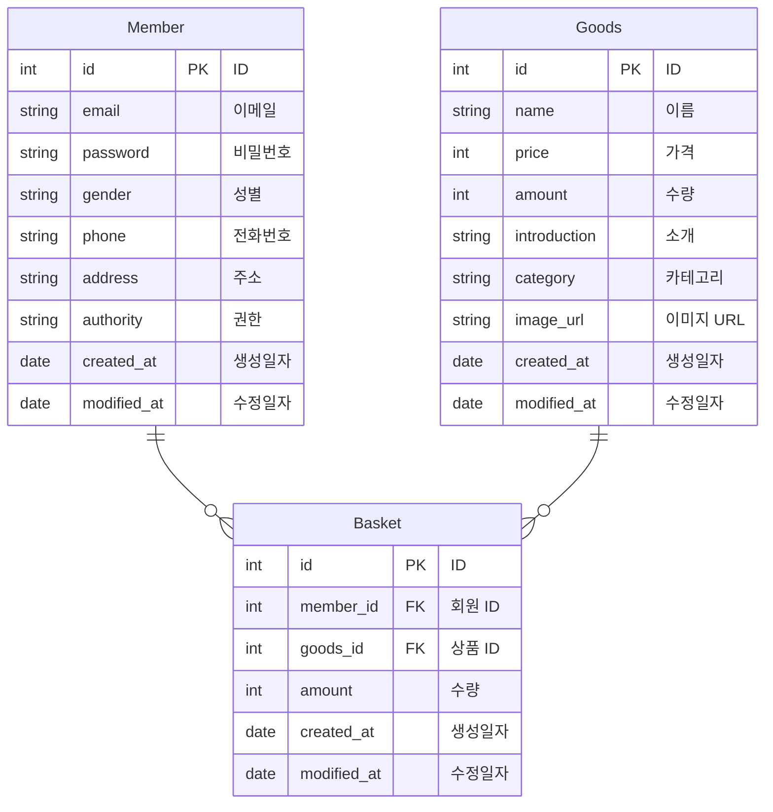

# 스파르타 굿즈 판매 사이트 서버 만들기

> Spring 주특기 다섯번째 과제

## 🔧 구현 기능

- [x]  회원 가입 기능
    - `이메일`, `비밀번호`, `성별`, `전화번호`, `주소`, `권한`을 저장할 수 있습니다.
        - ADMIN, USER `권한`이 있습니다.
        - `이메일`은  `올바른 이메일 형식`을 지켜야 합니다.
        - `비밀번호`는  `최소 8자 이상, 15자 이하이며 알파벳 대소문자(a~z, A~Z), 숫자(0~9), 특수문자`로 구성되어야 합니다.
    - 회원가입 성공을 확인할 수 있는 값을 반환합니다.
        - ex) HTTP Status Code, Error Message …
- [x]  로그인 기능
    - 회원은 `이메일`, `비밀번호`를 입력하여 서버에 로그인을 요청할 수 있습니다.
    - 로그인 성공 시, `회원의 정보`와 `JWT`를 활용하여 토큰을 발급하고,
    발급한 토큰을 Header에 추가한 후 로그인 성공을 확인할 수 있는 값과 함께 반환합니다.
        - ex) HTTP Status Code, Error Message …
- [x]  상품 등록 기능
    - `상품명`, `가격`, `수량`, `소개`, `카테고리`를 저장할 수 있습니다.
        - 로그인을 통해 발급받은 JWT가 함께 요청됩니다.
        - ADMIN 권한을 가진 회원만 상품 등록이 가능합니다.
        - `카테고리` 종류는 자율입니다.
    - 등록된 상품의 정보를 반환 받아 확인할 수 있습니다.
- [x]  선택한 상품 조회 기능
    - 선택한 상품의 정보를 조회할 수 있습니다.
        - 모든 사용자가 상품을 조회할 수 있습니다.
- [x]  상품 목록 조회 기능
    - 등록된 상품들을 조회할 수 있습니다.
        - 모든 사용자가 상품을 조회할 수 있습니다.
        - 페이지 별로 상품을 정해진 숫자만큼 순서대로 조회할 수 있습니다. (Paging)
    - 조회된 상품 목록은 선택한 기준에 의해 정렬됩니다.
        - `상품명`, `가격` 중 기준을 선택할 수 있습니다.
        - 내림차순, 오름차순을 선택할 수 있습니다.
- [x]  장바구니 추가 기능
    - 선택한 상품을 장바구니에 추가할 수 있습니다.
        - 로그인을 통해 발급받은 JWT가 함께 요청됩니다.
        - 회원만 장바구니에 상품을 추가하는 것이 가능합니다.
        - 장바구니에 추가된 상품은 구매할 만큼의 수량으로 선택될 수 있습니다.
        - 장바구니에는 여러 개의 상품이 추가될 수 있습니다.
    - 장바구니 추가 성공을 확인할 수 있는 값을 반환합니다.
        - ex) HTTP Status Code, Error Message …
- [x]  장바구니 조회 기능
    - 장바구니에 추가된 상품들의 정보와 수량을 조회할 수 있습니다.
        - 로그인을 통해 발급받은 JWT가 함께 요청됩니다.
        - 회원만 장바구니 조회가 가능합니다.
    - 장바구니에 담긴 상품들의 총 결제 금액을 확인할 수 있습니다.
- [x]  장바구니 수정 기능
    - 장바구니에서 선택한 상품의 수량을 수정할 수 있습니다.
        - 로그인을 통해 발급받은 JWT가 함께 요청됩니다.
        - 회원만 장바구니 수정이 가능합니다.
    - 장바구니 수정 성공을 확인할 수 있는 값을 반환합니다.
        - ex) HTTP Status Code, Error Message …
- [x]  장바구니 삭제 기능
    - 장바구니에서 선택한 상품을 삭제할 수 있습니다.
        - 로그인을 통해 발급받은 JWT가 함께 요청됩니다.
        - 회원만 장바구니 삭제가 가능합니다.
    - 장바구니 삭제 성공을 확인할 수 있는 값을 반환합니다.
        - ex) HTTP Status Code, Error Message …
- [x]  공통 기능
    - 로그인 요청의 비밀번호 불일치 등 API 요청의 예외가 발생하는 모든 경우에 대해서 실패(예외상황)에 대해 판단할 수 있는 Status Code, Error 메시지등의 정보를 반환합니다.
- [x]  상품 이미지 기능
    - 상품의 이미지를 업로드할 수 있습니다.
        - AWS의 S3를 사용하여 저장합니다.
- [x]  서비스 배포
    - AWS의 EC2와 RDS를 사용하여 ‘스파르타 굿즈 판매 사이트’ 프로젝트를 배포합니다.
- [x]  Spring Security를 적용하여 인증/인가를 구현합니다.
    - Security의 Secured 기능을 사용하여 권한별로 API를 제어할 수 있습니다.
- [x]  swagger를 구글링해 보고 프로젝트에 적용해 보세요!
    - swagger란? Open Api Specification(OAS)를 위한 프레임워크 입니다.
        - API들이 가지고 있는 스펙(spec)을 명세, 관리할 수 있으며 백엔드와 프론트엔드가 협업할 때 사용할 수 있습니다!

## 📚 스택

- JDK 17
- Spring Boot 3.1.9
- Spring Boot JPA
- Spring Boot Validation
- Spring Boot Security
- Swagger UI
- QueryDsl
- JWT
- AWS EC2
- AWS S3
- Redis
- MySQL
- H2

## 🖼️ Use Case Diagram

## 🔖 ERD

## 📄 API 명세서

